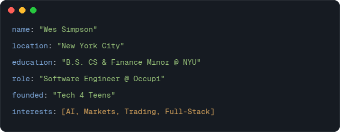
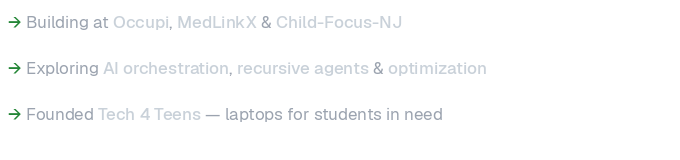

<!-- ═══════════════════════════════════════════════════════════════ -->
<!--  README.md — Wes Simpson · github.com/wessimpson               -->
<!--  Typeface: Geist by Vercel (https://vercel.com/font)           -->
<!-- ═══════════════════════════════════════════════════════════════ -->

<!-- Hero -->
<picture>
  <source media="(prefers-color-scheme: dark)" srcset="./assets/hero-dark.png">
  <source media="(prefers-color-scheme: light)" srcset="./assets/hero-light.png">
  
</picture>
 
<!-- Social links -->
&nbsp;
&nbsp;

  
<!-- Divider -->
<picture>
  <source media="(prefers-color-scheme: dark)" srcset="./assets/divider-dark.png">
  <source media="(prefers-color-scheme: light)" srcset="./assets/divider-light.png">
  
</picture>

 
<!-- ─── About Me ─────────────────────────────────────────────── -->
<picture>
  <source media="(prefers-color-scheme: dark)" srcset="./assets/header-about-dark.png">
  <source media="(prefers-color-scheme: light)" srcset="./assets/header-about-light.png">
  
</picture>
  

<picture>
  <source media="(prefers-color-scheme: dark)" srcset="./assets/about-card-dark.png">
  <source media="(prefers-color-scheme: light)" srcset="./assets/about-card-light.png">
  
</picture>

 
<!-- ─── What I'm Working On ──────────────────────────────────── -->
<picture>
  <source media="(prefers-color-scheme: dark)" srcset="./assets/header-working-dark.png">
  <source media="(prefers-color-scheme: light)" srcset="./assets/header-working-light.png">
  
</picture>
  

<picture>
  <source media="(prefers-color-scheme: dark)" srcset="./assets/currently-dark.png">
  <source media="(prefers-color-scheme: light)" srcset="./assets/currently-light.png">
  
</picture>

 
<!-- ─── Tech Stack ───────────────────────────────────────────── -->
<!-- ─── Tech Stack ───────────────────────────────────────────── -->
<picture>
  <source media="(prefers-color-scheme: dark)" srcset="./assets/header-tech-dark.png">
  <source media="(prefers-color-scheme: light)" srcset="./assets/header-tech-light.png">
  
</picture>
  

<strong>Languages</strong>

<picture>
  <source media="(prefers-color-scheme: dark)" srcset="https://skillicons.dev/icons?i=js,ts,py,ruby,rust,java,mysql,c,cpp,go,bash,html,css,graphql&theme=dark&perline=7">
  <source media="(prefers-color-scheme: light)" srcset="https://skillicons.dev/icons?i=js,ts,py,ruby,rust,java,mysql,c,cpp,go,bash,html,css,graphql&theme=light&perline=7">
  
</picture>

  

<strong>Frameworks & Libraries</strong>

<picture>
  <source media="(prefers-color-scheme: dark)" srcset="https://skillicons.dev/icons?i=react,nextjs,rails,nodejs,tailwind,express,fastapi,flask,django,vue,threejs,pytorch,tensorflow,sklearn,selenium,jest&theme=dark&perline=8">
  <source media="(prefers-color-scheme: light)" srcset="https://skillicons.dev/icons?i=react,nextjs,rails,nodejs,tailwind,express,fastapi,flask,django,vue,threejs,pytorch,tensorflow,sklearn,selenium,jest&theme=light&perline=8">
  
</picture>

  

<strong>Tools & Platforms</strong>

<picture>
  <source media="(prefers-color-scheme: dark)" srcset="https://skillicons.dev/icons?i=git,aws,docker,vercel,postgres,mongodb,redis,sqlite,supabase,gcp,heroku,terraform,githubactions,linux,postman,figma,notion,vscode,cloudflare,stripe&theme=dark&perline=10">
  <source media="(prefers-color-scheme: light)" srcset="https://skillicons.dev/icons?i=git,aws,docker,vercel,postgres,mongodb,redis,sqlite,supabase,gcp,heroku,terraform,githubactions,linux,postman,figma,notion,vscode,cloudflare,stripe&theme=light&perline=10">
  
</picture>

<!-- ─── GitHub Stats ─────────────────────────────────────────── -->
<picture>
  <source media="(prefers-color-scheme: dark)" srcset="./assets/header-stats-dark.png">
  <source media="(prefers-color-scheme: light)" srcset="./assets/header-stats-light.png">
  
</picture>
  

<picture>
  <source media="(prefers-color-scheme: dark)" srcset="https://streak-stats.demolab.com/?user=wessimpson&hide_border=true&background=00000000&ring=238636&fire=238636&currStreakNum=c9d1d9&currStreakLabel=238636&sideNums=c9d1d9&sideLabels=c9d1d9&dates=8b949e">
  <source media="(prefers-color-scheme: light)" srcset="https://streak-stats.demolab.com/?user=wessimpson&hide_border=true&background=00000000&ring=238636&fire=238636&currStreakNum=1f2328&currStreakLabel=238636&sideNums=1f2328&sideLabels=656d76&dates=afb8c1">
  
</picture>

 
<!-- ─── Footer ───────────────────────────────────────────────── -->

<picture>
  <source media="(prefers-color-scheme: dark)" srcset="./assets/divider-dark.png">
  <source media="(prefers-color-scheme: light)" srcset="./assets/divider-light.png">
  
</picture>
  
<picture>
  <source media="(prefers-color-scheme: dark)" srcset="./assets/footer-dark.png">
  <source media="(prefers-color-scheme: light)" srcset="./assets/footer-light.png">
  
</picture>
 

